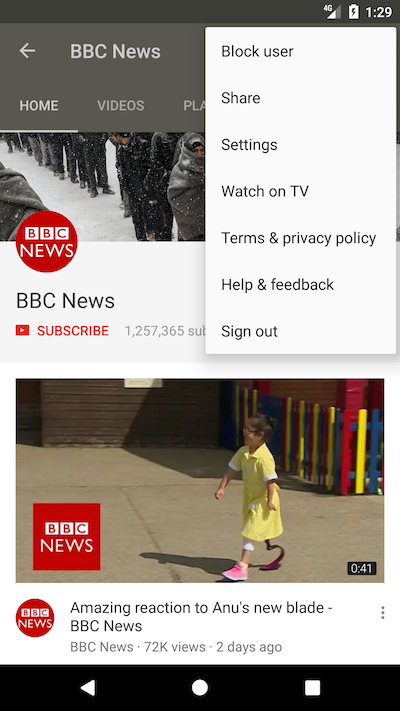

# PodTube
 

Because [youtube RED](https://www.youtube.com/red) is not available in most country, this app allows you to download a youtube video or subscribe to a youtube channel.

The main goal is to be able to subscribe to a channel or a user as we subscribe to podcast. 
To either have an audio or video podcast from youtube and be able to play in background our favorites youtube shows.

If you share a youtube user / channel / playlist page with [pushbullet](https://www.pushbullet.com/) open it on your phone,
click on the share button and select PodTube you will be able to subscribe to this feed

For example : https://www.youtube.com/user/CNN

Or you can directly from your phone share a video or a playlist to either download it or add the feed in your library.

WARNING: PUTTING PODTUBE OR ANY FORK OF IT INTO GOOGLE PLAYSTORE VIOLATES THEIR TERMS OF CONDITIONS.

## What's new in 

### 1.3.1:
- Allow to set a custom download folder for a feed
- Refresh feed list by swipping
- Add download speed /size information (click on the progress bar)
### 1.3.0:
- Manually parse feed xml to retrieve the feed / item cover and description
- Get feed / entry thumbnail
### 1.2.0:
- Change downloader library to improve download performance use a modify version of Gigaget
- Add preference to change downloads path
- Delete a feed from the library
### 1.1.0:
- Manage playlist : you can now share a playlist from pushBullet or from the share button in the youtube android app
### 1.0.0:
- New download manager
- Display notifications when a download start / end
- You can retry / delete / play a download item

## Screenshots

### Share/Add Playlist to library 

### Share/Add User feed to library (Available since youtube 12.16.56)

### Browse a feed 

### Feed's library

### Download video / audio

### Download Manager

## Libraries:

- Android based YouTube url extractor : https://github.com/HaarigerHarald/android-youtubeExtractor
- Annotation-triggered method call by specified thread : https://github.com/KoMinkyu/teaspoon
- Json Parser : https://github.com/google/gson
- Gigaget Downloader : https://github.com/PaperAirplane-Dev-Team/GigaGet
- Butterknife View binder : https://github.com/JakeWharton/butterknife
- Glide Image downloader : https://github.com/bumptech/glide
- Simple XML parser : http://simple.sourceforge.net/

## TODO (next):

- Choose in which directory do download a file at download time
- Settings for a feed (download directory, category, automatic download...)
- Make podtube compatible with most podcast player
- Download automatically the last episode released
- Search for feed to add
- New marked when a new episode is available
- Button "Mark all as read"
- Erase specific settings
- Have a cleaner UI
- Improve code

