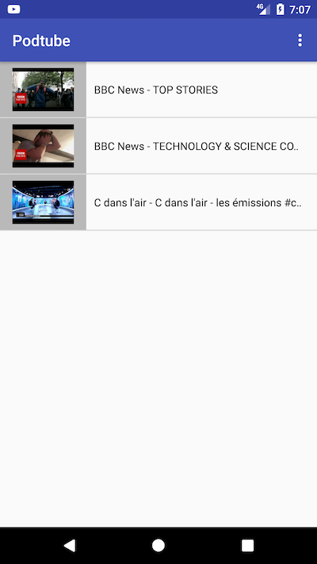

# PodTube

This app allows you to download a youtube video or subscribe to a youtube channel.

The main goal is to be able to subscribe to a channel or a user as we subscribe to podcast. 
To either have an audio or video podcast from youtube.

If you share a youtube user / channel / playlist page with [pushbullet](https://www.pushbullet.com/) open it on your phone,
click on the share button and select PodTube you will be able to subscribe to this feed

For example : https://www.youtube.com/user/CNN

### Browse a feed 
")
### Feed library

### Download video / audio

### Download Manager

## Libraries:

- Android based YouTube url extractor : https://github.com/HaarigerHarald/android-youtubeExtractor
- Annotation-triggered method call by specified thread : https://github.com/KoMinkyu/teaspoon
- Atom RSS parser : https://github.com/einmalfel/Earl
- Json Parser : https://github.com/google/gson
- File Downloader : https://github.com/lingochamp/FileDownloader

## What's new:
- Manage playlist : you can now share a playlist from pushBullet or the share android button
- You can retry / delete / play a download item
 

## TODO (next):

- Manually parse feed xml to retrieve the feed / item cover and description
- Find a way to easily subscribe to a feed/user without going through pushbullet.
- Send a notification when a download start / end
- Allow to choose in which directory do download (in a settings are at download time)
- Find a way to be podcast player compatible
- Search for feed to add
- Delete a feed 
- Have a cleaner UI
- Improve code

